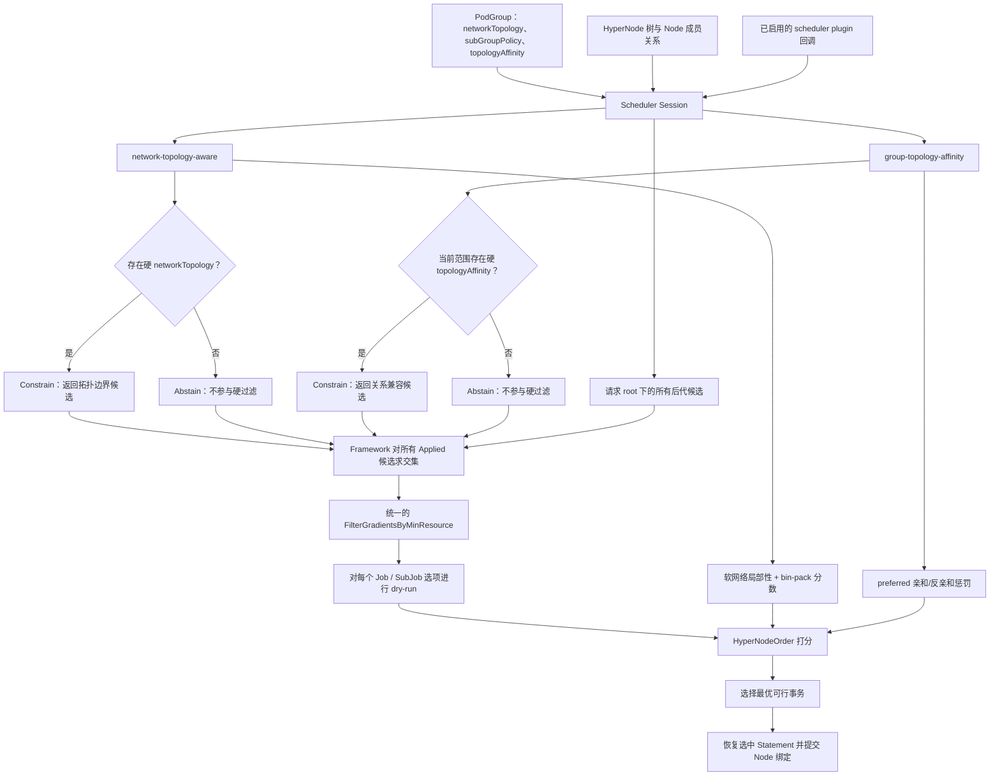
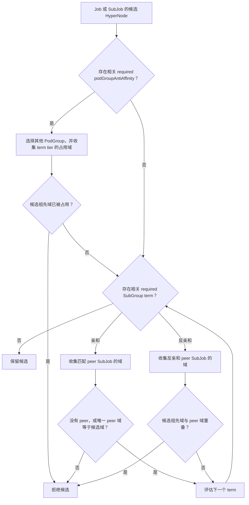
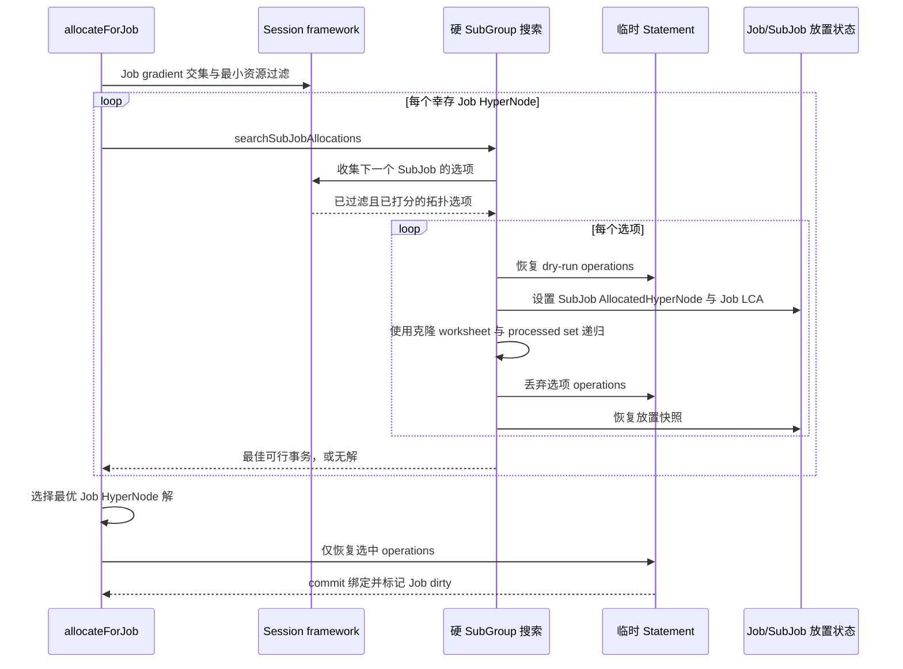

# HyperNode 插件实现指南

本文面向需要修改 HyperNode 调度路径的维护者，说明当前仓库中的实现逻辑，
而不是定义新的用户 API。YAML 语义请阅读[Topology Affinity 用户指南](../user-guide/how_to_use_topology_affinity.md)，特性背景请阅读[Group Topology Affinity 设计](./group-topology-affinity.md)。英文版本见[HyperNode Plugins Implementation Guide](./hypernode-plugins-implementation.md)。

## 1. 心智模型与职责边界

两个插件共享同一份 HyperNode 数据，但回答的问题不同：

| 组件 | 负责什么 | 不负责什么 |
| --- | --- | --- |
| `network-topology-aware` | `networkTopology` 的硬拓扑边界、软局部性偏好、HyperNode/Node 级 bin packing，以及 Session 内的 HyperNode 资源缓存 | PodGroup/SubGroup 间的拓扑关系 |
| `group-topology-affinity` | `topologyAffinity`：跨 PodGroup 反亲和，以及同一 PodGroup 内的 SubGroup 亲和/反亲和 | HyperNode 容量账本、Pod 级 predicate、`networkTopology` 边界 |
| framework + `allocate` action | 调用已启用回调、求硬候选交集、执行统一的最小资源过滤、dry-run Node 放置、挑选并提交解 | 代替任一插件解释对方的 API |

最重要的设计规则是：两个插件**不直接互调**。它们通过 `Session` 独立发布约束和分数；framework 只组合实际生效的硬约束，`allocate` action 再完成最终的 Node 级可行性判断。

### 共享调度状态

`Session` 提供两个插件都会使用的 HyperNode 树快照和 Node 成员关系：

- `HyperNodes`：`name -> HyperNodeInfo`，包含 parent、children、数字 tier 与 tier name。
- `RealNodesSet`：`hyperNode -> 所有后代 Kubernetes Node 的集合`。
- `RealNodesList`：对应的 `NodeInfo` 列表，用于 predicate 和打分。
- `HyperNodeTierNameMap`：将 API 的 `topologyTierName` 解析为数字 tier。
- `JobInfo.AllocatedHyperNode` 与 `SubJobInfo.AllocatedHyperNode`：当前放置/LCA 视图。亲和占用优先从真实已分配 Task 推导；无法获得 Task 到 HyperNode 映射时才以这两个字段兜底。

所有 term 比较的是候选 HyperNode 在 term tier 上的**祖先 HyperNode 名称**，从不直接比较 Kubernetes Node 名称。

## 2. 调度主流程

下图是两个插件的组合中心。`Abstain` 与空硬约束结果有本质差异：前者不缩小候选全集，后者表示已生效的硬约束没有可行 HyperNode。



### 2.1 回调注册

Session 打开时，`network-topology-aware` 注册：

- `AddHyperNodeGradientForJobFn` 与 `AddHyperNodeGradientForSubJobFn`，仅处理硬 `networkTopology`；
- `AddHyperNodeOrderFn`，处理 HyperNode bin packing 和软拓扑局部性；
- `AddBatchNodeOrderFn`，在已选 HyperNode 内给 Node 打分；
- allocation/deallocation event handler，更新聚合资源缓存。

`group-topology-affinity` 注册：

- 同样的两个 gradient hook，处理硬 topology-affinity term；
- `AddHyperNodeOrderFn`，处理 `preferred` topology-affinity term。

在 scheduler 配置中必须显式打开 `enabledHyperNodeGradient` 与 `enabledHyperNodeOrder`。仅注册回调并不会让它们生效。

### 2.2 Framework 的交集逻辑保持中立

`Session.HyperNodeGradientForJobFn` 与 `Session.HyperNodeGradientForSubJobFn` 会按 scheduler tier 顺序遍历配置中已启用的插件，并记录每个插件的 `HyperNodeGradientResult`：

- `Applied=false`（`HyperNodeGradientAbstain`）代表没有硬约束意见。
- `Applied=true` 且有候选，代表该插件的硬候选名称集合。
- `Applied=true` 且候选为空，代表生效的硬约束不可满足。

Framework 将每个 `Applied` 结果与 root 的后代候选全集求交集，然后有意将幸存者压平为一个按 `(tier, name)` 排序的确定性层。插件不能依赖私有 gradient 层的顺序表达偏好；偏好必须进入 `HyperNodeOrderFn`。

Framework 会将每插件与交集后的 tier 数记录到 `HyperNodeGradientStats`。后续 `allocate` 会补充资源过滤统计并写入 `JobFitErrors`，从而让事件区分拓扑拒绝与 `minResource` 拒绝。

### 2.3 统一的资源门槛

`FilterGradientsByMinResource` 在 Job 和 SubJob 范围中都运行在硬约束交集之后。它聚合候选 HyperNode 后代 Node 的 `Idle` 与 `FutureIdle`，只要任一总量能满足最小资源请求就保留该候选。已存在放置的 Job/SubJob（`AllocatedHyperNode != ""`）会跳过这个过滤，以保持已有拓扑域。

不要把容量判断重新塞进任一插件的拓扑 BFS。容量过滤放在这里可以保证新增拓扑插件仍可组合，也只有一条统一的诊断路径。

## 3. `network-topology-aware` 的实现

### 3.1 硬拓扑边界

Job 或 SubJob 使用硬 `networkTopology` 时，插件从请求的 search root 出发，返回 `highestTierAllowed` 允许的 HyperNode。若工作负载已有放置，则 search root 进一步收敛到与既有放置兼容的分支。策略是 soft 或未设置时，硬回调返回 abstain，不会凭空创建拓扑约束。

该结果是一个**聚合边界**，不是与其他工作负载的关系。插件不会读取 `topologyAffinity` 字段。

### 3.2 软放置与 bin packing

在 HyperNode order 阶段，插件先基于 Session 内的聚合资源缓存计算 bin-pack 分数，再追加 SubJob 及其所属 Job 的软 `networkTopology` 放置偏好。最高 HyperNode 分数相同会使用已调度 task 数打破平局，最后归一化插件分数。

在 Node order 阶段，它会给选中 HyperNode 内的 Node 提供 batch score。因此一个 HyperNode 候选可行并不等于已经绑定：常规 predicate 与 Node order 仍会选出具体 Node。

资源缓存会在 session 打开时由每个 HyperNode 的后代 Node 初始化，并由 allocation/deallocation event handler 更新。它是打分缓存；真正的硬聚合容量门槛仍由统一的 `FilterGradientsByMinResource` 执行。

## 4. `group-topology-affinity` 的实现

`group-topology-affinity` 面向关系约束。只有当前 Job/SubJob 有相关 `required` term 时，硬回调才过滤候选；软回调只对 `preferred` term 打分。这个分离很关键：软亲和绝不能使工作负载保持 Pending。

### 4.1 范围与占用

约束分为两个范围：

- **Job 范围：**`podGroupAntiAffinity` 将当前 PodGroup 与已放置且匹配的 PodGroup 比较。`PodGroupMatchesTerm` 会排除相同 UID。每个 peer 会贡献其已分配 Task 所在的每个拓扑域；尚未放置的 peer 不占用任何域。
- **SubJob 范围：**`subGroupAffinity` 与 `subGroupAntiAffinity` 只比较同一 Job/PodGroup 的 peer SubJob。`SubJobPolicyName` 从 SubJob GID 推导策略名；term 填的是 `subGroupPolicy[].name`，不是 Pod label 或 SubJob ID。

上述两个范围都优先使用 Task 推导的占用域，避免把一个较粗 LCA 以下的所有 sibling 误判为已占用。基于 `AllocatedHyperNode` 的 LCA 兜底仅用于缓存缺口、测试或 session 初始化阶段，属于 best effort。

### 4.2 硬候选评估

插件先从 PodGroup 反亲和 gradient 或完整子树得到基础候选，再只应用包含当前 SubJob policy 的 term。多个 required term 是 AND 关系：任一拒绝都会删除候选。



`subGroupAntiAffinity` 的 peer 选择规则很容易误改，必须与 admission validation 保持一致：

- 单策略 term，例如 `[prefill]`，比较当前 SubJob 与其他 `prefill` SubJob（同策略展开）。
- 多策略 term，例如 `[prefill, decode]`，只比较另一个被列出的策略（跨策略隔离）。它不会让两个 `prefill` SubJob 分散；需要额外单策略 term。

对 `subGroupAffinity`，term 中每个策略都是 peer。若比较 tier 上的 peer 已经占用两个以上域，则任何新候选都无法修复该状态，因此硬 term 会拒绝当前 SubJob 的全部候选。

### 4.3 Preferred term 是惩罚，不是过滤

`hyperNodeOrderFn` 将每个候选初始分设为 `1.0`。每遇到一个违背的 preferred term，就减去 `weight / 100`，最低截断为 `0`，最后乘以插件 `weight` 与 Kubernetes `MaxNodeScore`。

- preferred PodGroup 反亲和：候选落入匹配 peer 的占用域时惩罚。
- preferred SubGroup 亲和：候选不是唯一 peer 占用域时惩罚。
- preferred SubGroup 反亲和：候选与适用 peer 域重叠时惩罚。

这些分数会通过 `HyperNodeOrderMapFn` 与 network-topology-aware 分数一起提交；它们不会参与硬 gradient 交集。

## 5. Allocation：为何硬 SubGroup 拓扑必须搜索

Job 级候选只是潜在边界。`allocateForJob` 会对每个幸存的 Job HyperNode 进行 dry-run，并调用 `allocateForJobInHyperNode` 寻找完整 Job 事务。每个 SubJob 选项已经通过两个插件的硬约束交集和统一的最小资源过滤，然后才被 dry-run 到具体 Node。

没有硬 SubGroup 拓扑 term 的 Job 可以在普通事务循环中依次处理 SubJob。存在硬 `subGroupAffinity` 或 `subGroupAntiAffinity` 时，一个 SubJob 的放置会改变其 peer 的可选域，因此 allocator 必须搜索组合，而不是提交第一个局部最优 SubJob 结果。



`topologySearchContext` 会为等价状态记住最高累计分数。一个状态包含 Job/SubJob 放置、Task 状态、待处理工作与已处理 SubJob 集合；分数更低或相同的重复状态会被剪枝。这避免了重复排列搜索，又不会把部分放置误当成已提交状态。

`workingSet` 明确了 gang 事务范围：它先包含 required SubJob，若为空则包含一个 fallback SubJob。即使常规 Job readiness 已达成，所有 working-set SubJob 都参与前搜索也不能结束。这正是 topology-affinity 能正确评估全部 required peer 的保障。

收集完候选解后，`selectBestHyperNodeForJob` 依次偏好 Job 级软 network-topology rank、已放置的软拓扑目标 SubJob 数、聚合 HyperNode 分数、更细 tier，最后使用确定性名称排序。只有选中 `Statement` 的 operations 会被恢复并提交；其余试探 Statement 与放置变更都会被丢弃/恢复。

## 6. 诊断与修改清单

### 有用的诊断信息

- V(3) 日志输出硬候选生成、交集/资源排除、SubJob 选项收集，以及最终拓扑搜索的 explored/pruned 数。
- V(4) 日志输出每个 preferred term 的惩罚细节。
- `JobFitErrors` 会组合 Job 级 HyperNode 摘要与失败 SubJob 摘要。当前 `group-topology-affinity` 的通用诊断 label 是 `podGroupAntiAffinity`；在断言具体规则前，应先查看 term 日志。
- 修改占用逻辑时，要测试 Job 横跨多个 sibling 域的场景。逐 Task 收集必须只保留真实占用域，不能把 Job LCA 展开为所有 sibling。

### 修改清单

1. 新的强制拓扑策略应进入 gradient callback：不适用时返回 `Abstain`，适用但无候选时返回 `Constrain(empty)`。
2. 新的偏好应进入 order callback，不能做成硬过滤。
3. 保留 framework 的交集逻辑和统一最小资源过滤，不能让一个插件静默覆盖另一个插件的候选。
4. dry-run 中临时改变放置时，每个分支都要快照并恢复 Job 与 SubJob 的 `AllocatedHyperNode`。
5. 占用域优先从已绑定 Task 推导；LCA 兜底只是兼容路径，不能当作精确占用。
6. 修改实现行为时，要增加所有受影响层的测试：插件语义、framework 组合、allocation 搜索/回滚，以及聚焦 Kind 工作负载。

## 7. 源码地图与测试

| 关注点 | 主要源码 |
| --- | --- |
| HyperNode 树、tier 解析、Task 推导的占用 | `pkg/scheduler/api/hyper_node_info.go`、`pkg/scheduler/api/topology_affinity_info.go` |
| Gradient 结果契约与 fit 摘要 | `pkg/scheduler/api/types.go`、`pkg/scheduler/api/unschedule_info.go` |
| Framework 注册、候选全集与交集 | `pkg/scheduler/framework/session_plugins.go` |
| Network topology 约束、打分、资源缓存 | `pkg/scheduler/plugins/network-topology-aware/network_topology_aware.go` |
| Group topology 硬过滤与 preferred 打分 | `pkg/scheduler/plugins/group-topology-affinity/group_topology_affinity.go` |
| 统一资源过滤、dry-run、回溯、提交 | `pkg/scheduler/actions/allocate/allocate.go` |

常用的聚焦单元测试入口：

```bash
go test ./pkg/scheduler/plugins/network-topology-aware -count=1
go test ./pkg/scheduler/plugins/group-topology-affinity -count=1
go test ./pkg/scheduler/framework -run 'HyperNodeGradient|Intersect' -count=1
go test ./pkg/scheduler/actions/allocate -run 'Topology|SubGroup|Gradient' -count=1
```

任何会改变调度行为的实现修改，都应在现有的[topology-affinity 示例](../../example/topology-affinity/README.md)中增加最小、已确认的 Kind 用例，并以本地构建镜像验证后再标记完成。
