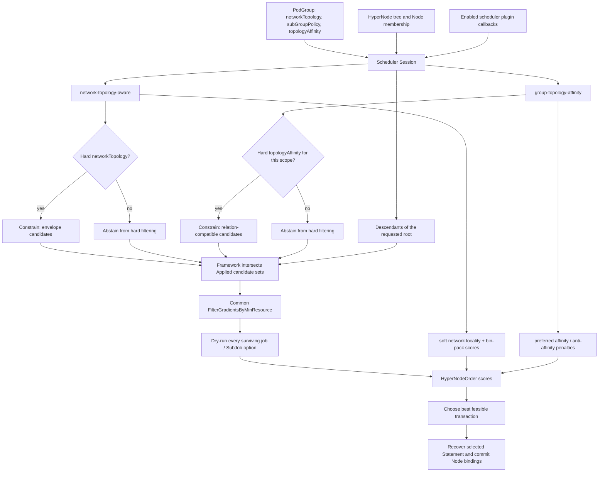
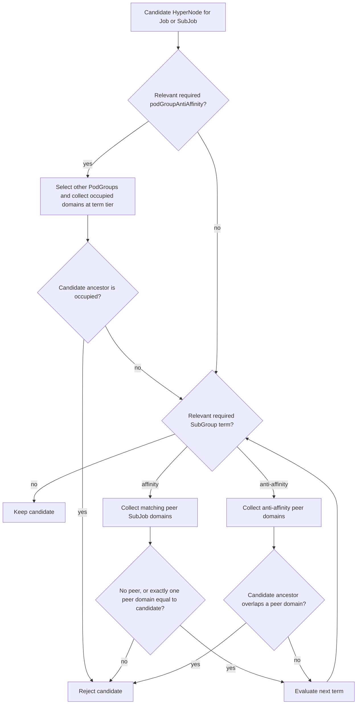
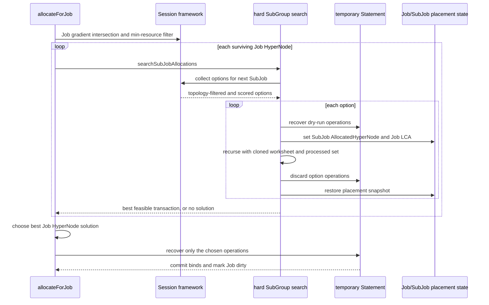

# HyperNode Plugins Implementation Guide

This document is for maintainers changing the scheduler paths that understand
the HyperNode tree. It describes the implementation currently in this
repository, rather than defining a new user-facing API. Read the [Topology
Affinity User Guide](../user-guide/how_to_use_topology_affinity.md) for YAML
semantics, and [Group Topology Affinity Design](./group-topology-affinity.md)
for the feature rationale. A [Chinese version](./hypernode-plugins-implementation-cn.md)
is also available.

## 1. Mental model and ownership

The two plugins share the same HyperNode data, but they own different questions:

| Plugin | Owns | Does not own |
| --- | --- | --- |
| `network-topology-aware` | `networkTopology` hard envelope, soft locality preference, HyperNode and node-level bin packing, and a session-local HyperNode resource cache | PodGroup/SubGroup relationship rules |
| `group-topology-affinity` | `topologyAffinity`: cross-PodGroup anti-affinity plus intra-PodGroup SubGroup affinity and anti-affinity | HyperNode capacity accounting, Pod-level predicates, or `networkTopology` envelope rules |
| framework + `allocate` action | Runs enabled callbacks, intersects hard candidate sets, applies the common min-resource gate, dry-runs Node placement, chooses and commits a solution | Interpreting one plugin's API on behalf of the other |

The key architectural rule is that the plugins **do not call each other**. They
publish independent constraints and scores through `Session`; the framework
combines only the applicable hard constraints, then the allocation action makes
the final Node-level feasibility decision.

### Shared scheduler state

`Session` exposes a snapshot of the HyperNode tree and the Node membership
needed by both plugins:

- `HyperNodes`: `name -> HyperNodeInfo`, including parent, children, numeric
  tier, and tier name.
- `RealNodesSet`: `hyperNode -> set of descendant Kubernetes Nodes`.
- `RealNodesList`: the corresponding `NodeInfo` lists used for predicate and
  scoring work.
- `HyperNodeTierNameMap`: resolves API `topologyTierName` to a numeric tier.
- `JobInfo.AllocatedHyperNode` and `SubJobInfo.AllocatedHyperNode`: the current
  placement/LCA view. For affinity occupancy, actual allocated Tasks are the
  primary source; these fields are a fallback when task-to-HyperNode mapping is
  not available.

Terms compare the name of a candidate's **ancestor HyperNode at the term
tier**. They never compare raw Kubernetes Node names.

## 2. Scheduling pipeline

The following flow is the central composition point. `Abstain` is intentionally
different from an empty hard result: the former leaves the candidate universe
unchanged, while the latter means an active constraint has no feasible
HyperNode.



### 2.1 Callback registration

On session open, `network-topology-aware` registers:

- `AddHyperNodeGradientForJobFn` and `AddHyperNodeGradientForSubJobFn` for
  hard `networkTopology` only;
- `AddHyperNodeOrderFn` for HyperNode bin packing and soft topology locality;
- `AddBatchNodeOrderFn` for Node scoring within a selected HyperNode; and
- allocate/deallocate event handlers that update its aggregated resource cache.

`group-topology-affinity` registers:

- the same two gradient hook types for hard topology-affinity terms; and
- `AddHyperNodeOrderFn` for `preferred` topology-affinity terms.

Both hooks must be enabled explicitly by `enabledHyperNodeGradient` and
`enabledHyperNodeOrder` in the scheduler configuration. Registration alone is
not enough.

### 2.2 Framework intersection is deliberately neutral

`Session.HyperNodeGradientForJobFn` and
`Session.HyperNodeGradientForSubJobFn` enumerate configured enabled plugins in
scheduler-tier order. For each plugin they record a
`HyperNodeGradientResult`:

- `Applied=false` (`HyperNodeGradientAbstain`) contributes no hard opinion.
- `Applied=true` with candidates contributes its candidate names.
- `Applied=true` with zero candidates is an unschedulable hard result.

The framework intersects every `Applied` result with the descendant candidate
universe. It then intentionally flattens survivors into one deterministic
layer, ordered by `(tier, name)`. Plugins must therefore not rely on their
private gradient-layer order to express preference; preference belongs in an
`HyperNodeOrderFn`.

The framework records per-plugin and intersected counts in
`HyperNodeGradientStats`. `allocate` adds its later resource-filter statistics
to `JobFitErrors`, so an event can distinguish a topology rejection from a
`minResource` rejection.

### 2.3 The central resource gate

`FilterGradientsByMinResource` runs **after** hard constraint intersection for
both Job and SubJob scopes. It sums `Idle` and `FutureIdle` across each
candidate's descendant Nodes and retains the candidate if either total can
satisfy the requested minimum resource. This filter is skipped for an already
placed Job/SubJob (`AllocatedHyperNode != ""`), preserving its existing
placement domain.

Do not reintroduce this capacity decision into either plugin's topology BFS.
Keeping it here makes independently added topology plugins composable and
ensures a single diagnostic path.

## 3. `network-topology-aware` implementation

### 3.1 Hard envelope

For a Job or SubJob in hard `networkTopology` mode, the plugin starts at the
requested search root and returns HyperNodes allowed by
`highestTierAllowed`. If the work has an existing placement, the search root is
restricted to the compatible branch of that placement. If the policy is soft or
absent, the hard callback abstains; it does not manufacture a topology
constraint.

The result is an **envelope**, not a relation to another workload. The plugin
does not inspect `topologyAffinity` fields.

### 3.2 Soft placement and bin packing

At HyperNode order time, the plugin first computes its bin-pack score from the
session-local aggregate resource cache, then adds soft `networkTopology`
placement preference for the SubJob and, where applicable, the enclosing Job.
It uses task-count tie breaking when the leading HyperNode scores tie and
normalizes the final plugin score.

At Node order time, it provides a batch score for Nodes inside the selected
HyperNode. This is why a successful HyperNode candidate is not yet a binding:
the normal predicate and Node-order stages still choose a concrete Node.

The resource cache is initialized from every HyperNode's descendant Nodes at
session open and is updated by allocation/deallocation event handlers. It is a
scoring cache; the common `FilterGradientsByMinResource` remains the hard
aggregate capacity gate.

## 4. `group-topology-affinity` implementation

`group-topology-affinity` is relationship-aware. Its hard callback filters a
candidate only when the current Job/SubJob has a relevant `required` term; its
soft callback scores only `preferred` terms. This separation is important:
soft affinity must not make a workload Pending.

### 4.1 Scope and occupancy

There are two scopes:

- **Job scope:** `podGroupAntiAffinity` compares the current PodGroup with
  matching, already placed PodGroups. `PodGroupMatchesTerm` excludes the same
  UID. A peer contributes each topology domain occupied by its allocated Tasks;
  an unplaced peer contributes none.
- **SubJob scope:** `subGroupAffinity` and `subGroupAntiAffinity` compare only
  peer SubJobs in the same Job/PodGroup. `SubJobPolicyName` derives the policy
  name from the SubJob GID, and terms name `subGroupPolicy[].name` values, not
  Pod labels or SubJob IDs.

For both scopes, task-derived occupied domains are preferred over expanding an
LCA. This avoids falsely treating every sibling beneath a coarse LCA as
occupied. The LCA-based `AllocatedHyperNode` fallback exists for cache gaps and
test/session bootstrap cases, and is deliberately best effort.

### 4.2 Hard candidate evaluation

The plugin starts from either a PodGroup anti-affinity gradient or the full
subtree. It then applies only terms that include the current SubJob's policy.
Multiple required terms are an AND: any rejection drops the candidate.



The peer-selection rule for `subGroupAntiAffinity` is subtle and must be kept
in sync with admission validation:

- a one-name term, such as `[prefill]`, compares the current SubJob with other
  `prefill` SubJobs (intra-policy spread);
- a multi-name term, such as `[prefill, decode]`, compares only a different
  listed policy (cross-policy separation). It does not spread two `prefill`
  SubJobs; a separate one-name term is required for that.

For `subGroupAffinity`, every listed policy is a peer. If peers already occupy
more than one domain at the comparison tier, no new candidate can repair that
state, so the hard term rejects all candidates for the current SubJob.

### 4.3 Preferred terms are penalties, not filters

`hyperNodeOrderFn` begins every candidate at `1.0`. For each violated preferred
term it subtracts `weight / 100`, clamps the result to `0`, then scales the
result by plugin `weight` and Kubernetes `MaxNodeScore`.

- preferred PodGroup anti-affinity penalizes a candidate in a matching peer's
  occupied domain;
- preferred SubGroup affinity penalizes a candidate that is not the sole
  occupied peer domain; and
- preferred SubGroup anti-affinity penalizes a candidate that overlaps an
  applicable peer domain.

The scores are passed alongside the network-topology-aware score through
`HyperNodeOrderMapFn`. They are not used by the hard gradient intersection.

## 5. Allocation: why hard SubGroup topology needs search

The Job-level candidate is only a potential envelope. `allocateForJob` dry-runs
every surviving Job HyperNode and asks `allocateForJobInHyperNode` to find a
whole-job transaction. Each SubJob option has already passed the two plugins'
hard intersection and the common min-resource filter, then has been dry-run
onto concrete Nodes.

For jobs without hard SubGroup topology terms, SubJobs can be consumed in the
normal transaction loop. For jobs with hard `subGroupAffinity` or
`subGroupAntiAffinity`, placing one SubJob changes the eligible domains for its
peers. The allocator therefore searches combinations instead of committing the
first locally good SubJob result.



`topologySearchContext` memoizes the best cumulative score for an equivalent
state. A state contains Job/SubJob placement, task status, pending work, and
the processed SubJob set. A lower- or equal-scored revisit is pruned. This
protects the search from redundant permutations without treating a partial
placement as committed state.

`workingSet` makes the gang transaction explicit: it starts with required
SubJobs (or one fallback SubJob). The search cannot stop merely because normal
Job readiness has been reached until every working-set SubJob has participated.
This is the safeguard that lets topology-affinity evaluate all required peers.

After all candidate solutions are collected, `selectBestHyperNodeForJob`
prefers the Job-level soft network-topology rank when present, then the number
of soft-topology target SubJobs placed, aggregate HyperNode score, finer tier,
and finally a deterministic name order. Only the chosen `Statement` is
recovered and committed; all other trial statements and placement mutations are
discarded/restored.

## 6. Diagnostics and change checklist

### Useful diagnostics

- V(3) logs show hard candidate generation, intersection/resource exclusions,
  SubJob option collection, and the final topology search's explored/pruned
  state counts.
- V(4) logs provide individual preferred-term penalties.
- `JobFitErrors` combines the Job-level HyperNode summary with failed SubJob
  summaries. The current generic diagnostic label for the
  `group-topology-affinity` plugin is `podGroupAntiAffinity`; inspect term logs
  before assuming the rejected rule was PodGroup-level.
- When changing occupancy code, test a Job spanning multiple sibling domains.
  Per-task collection must retain only the actually occupied domains rather
  than expand the Job LCA to every sibling.

### Change checklist

1. Put a new mandatory topology policy in a gradient callback; return
   `Abstain` when it does not apply and `Constrain(empty)` when it applies but
   has no candidate.
2. Put a preference in an order callback, not a hard filter.
3. Preserve framework-level intersection and the central min-resource filter;
   never let one plugin silently override another's candidates.
4. If placement is temporarily changed during dry-run, snapshot and restore
   both Job and SubJob `AllocatedHyperNode` values on every branch.
5. Derive occupied domains from bound Tasks first. Treat an LCA fallback as a
   compatibility path, not as exact occupancy.
6. Add tests at all affected layers: plugin semantics, framework composition,
   allocation search/rollback, and a focused Kind workload when changing
   implementation behavior.

## 7. Source map and tests

| Concern | Primary source |
| --- | --- |
| HyperNode tree, tier resolution, task-derived occupancy | `pkg/scheduler/api/hyper_node_info.go`, `pkg/scheduler/api/topology_affinity_info.go` |
| Gradient result contract and fit summaries | `pkg/scheduler/api/types.go`, `pkg/scheduler/api/unschedule_info.go` |
| Framework registration, candidate universe, intersection | `pkg/scheduler/framework/session_plugins.go` |
| Network topology constraints, scoring, resource cache | `pkg/scheduler/plugins/network-topology-aware/network_topology_aware.go` |
| Group topology hard filtering and preferred scoring | `pkg/scheduler/plugins/group-topology-affinity/group_topology_affinity.go` |
| Common resource filter, dry-run, backtracking, commit | `pkg/scheduler/actions/allocate/allocate.go` |

Focused unit-test entry points include:

```bash
go test ./pkg/scheduler/plugins/network-topology-aware -count=1
go test ./pkg/scheduler/plugins/group-topology-affinity -count=1
go test ./pkg/scheduler/framework -run 'HyperNodeGradient|Intersect' -count=1
go test ./pkg/scheduler/actions/allocate -run 'Topology|SubGroup|Gradient' -count=1
```

For behavior that changes scheduling, add the smallest pre-agreed Kind case to
the existing [topology-affinity example](../../example/topology-affinity/README.md)
and verify it with locally built images before marking the implementation done.
